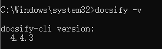
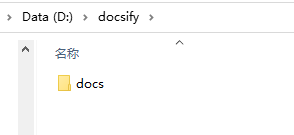
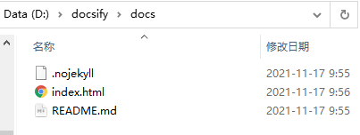
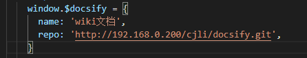

# **github+docsify部署**

1.环境

本地需要Node.js

2.安装

docsify安装（必须有Node.js）cmd输入：

npm install docsify-cli -g

-g代表全局安装

安装后输入docsify -v查看版本 测试是否正确安装

​                         

3.开始搭建

在想要构建文档的目录下新建文件夹

然后cmd进入该目录下，输入 docsify init ./docs 初始化文档路径，执行完后就可以看到该目录下多了一个docs文件夹

​                         

进入docs文件夹我们可以看到初始化生成的几个文件：                 
        

.nojekyll  用于阻止 GitHub Pages 忽略掉下划线开头的文件

index.html 入口文件

README.md 会做为主页内容渲染

命令行输入：

docsify serve docs

启动一个本地服务器，可以实时预览效果。默认访问地址 [http://localhost:3000](http://localhost:3000/) 。

index.html页面中的window.$docsify = {}下可以添加配置项，以个性化预览内容

​                         

如图。默认给出的两个配置项是:

name : 侧边栏大标题

repo : 右上角角标跳转地址

常用原生配置项：


```
    window.$docsify = {
      name: 'wiki文档',
      repo: 'http://192.168.0.200/cjli/docsify.git',
      //侧边栏目录，支持自定义文件名称，默认是_sidebar.md
      loadSidebar: true,
      loadSidebar: '_sidebar.md',
      //最大目录层级
      subMaxLevel: 5,
      //导航栏
      loadNavbar: true,
   }
```


docsify还有非常多的配置项和第三方插件支持、界面主题等定制化内容，可以使现在文档的展示效果更加美观、便捷。这些都可以在官方文档中查看：https://docsify.js.org/#/zh-cn/configuration


4.部署到GitHub

使用github的GitHub Pages功能，可以创建一个免费的静态网站


a.登录GitHub，创建仓库 

b.从本地导入，先进到站点目录，右键，选择Git Bash Here，打开Git命令行

c.输入 git init 初始化本地仓库

d.输入git add -A 添加所有文件到暂存区

e.git commit -m "123"  #提交到git仓库，-m后面是注释

f.git remote add origin https://github.com/galaxySkyy/galaxySkyy.git  #网址要根据情况变化

g.git push -u origin master  #推送到远程仓库

5.创建GitHub Page

选择到刚才创建的项目分支下，点击右上角setting，左侧栏选择page
